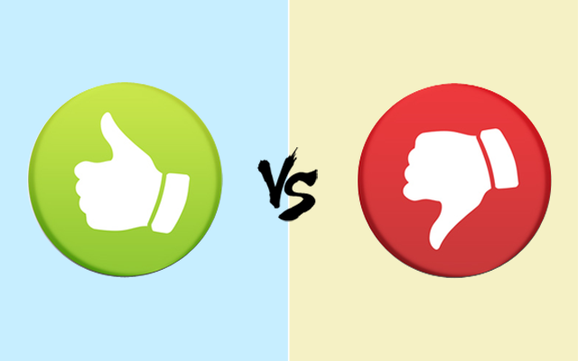

## Amanda Ezeobiejesi

Hi! I'm a student at Worcester Polytechnic Institute currently studying Computer Science. I am from Lagos, Nigeria, but grew up in Southern California.

This page includes some of the projects I have been working on in my Human Computer Interaction class, as well as some of my concluding thoughts on what a good design looks like and how it can be reached. 

Aside from design relating to user's experience, I like dance, draw, write poetry, and hang out with friends.


### My Design Process

Test Test Test Test Test Test Test Test Test Test Test Test Test Test Test Test

                              **~ Brainstorming ~**

Paragraph 1

Paragraph 2


                               **~ Prototyping ~**

During the creation of the projects with my various team members througout the term, there were multiple times when time and energy could have been saved, if we had taken the time necessary to prototype our ideas before implementing them. I noticed that in the projects where I dedicated significant time to sketching and creating mock-up versions of the product, the quality of the final product was much higher. I had more time to spend on the implementation and focus on the details. 

To create prototypes, I fitst created paper sketched, which were made into paper prototypes, and lastly into mock-up versions of a more design focused model. Below are the three examples that I just listed, which were used for the Design for Others project regarding the rebuilding of Technocopia's website. 

                              **~ User Feedback ~**
                   
Paragraph 1

Paragraph 2
        

                              **~ Finalization ~**

Paragraph 1

Paragraph 2


### Good Design, Bad Design


The objective of this assignment was to learn how to tell wether a design wasb a good or bad one. It helped me to start thinking about the designs around me and how how people interact with the digital world. Below are links to the medium posts about my ideas on some of the good and bad designs of the WPI website, www.wpi.edu.

[Good Design](https://medium.com/@amanda.c.eze/wpi-website-good-design-a26cd103796f) and [Bad Design](https://medium.com/@amanda.c.eze/wpi-website-bad-design-2d8abb710589).


### Design for Others


Description of assignment.

```markdown
Test
```

### Design for Understanding


Description of assignment.

```markdown
Test
```

### Design for Well-being


Description of assignment.

```markdown
Test
```

### Design for Another World


Description of assignment.

```markdown
Test
```

### Final Thoughts

Some of the biggest challenges I faced was being unfamilair with some of the new software and libraries used in class such as FlowXO, Affectiva, and AFrame. Since I did not know how to use some of these applications, it took me longer to fully understadn how to use them. Most of the coding languages used in this class I was already familiar with, however I did get to understadn the JavaScript coding language better. Throughout my time in this class, it was nice to be in groups of 3-4 people because it made communication easier and if one perso did not know how to use a particular software, the other team members could help. This was he case for me and I was very lucky to have extremely helpful classmates who were willing to take the time to teach me new things. 

In my future projects I hope to be able to integrate as many of the tools I learned to create a product that really focuses on giving the ultimate experience to users. I really enjoyed being able to explore different realms of the human computer interaction, and this class really spiked an interest and passion in me for design and UX.
